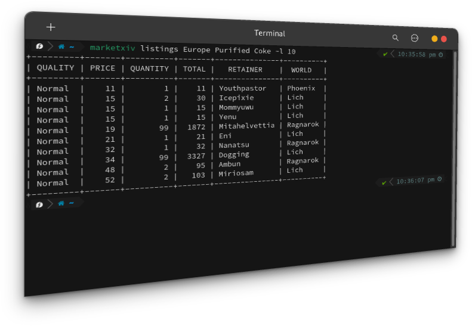

<div align="center">



### MarketXIV
Lightning-fast delivery of FFXIV market data to your Command Line 🚀🔥

#### Built With & Powered By
[](https://go.dev/)
[](https://universalis.app)
[](https://xivapi.com)

</div>

---

## About
### Why?
MarketXIV was created due to a lack of command line tools for getting market data from any FFXIV API. The command line is always super light-weight to keep open and fast to use, making it perfect for getting the necessary information about the market in a short amount of time.

### Features
- 🔥 Super Fast Responses: Get the information you need in a split second
- 🔧 Built-in Updater: All executable updates are handled for you
- 📦 Lightweight: Uses hardly any system storage or resources.
- ⚡ Powerful: Can fetch all the information you'd ever need.

## Installing
### Using Scoop (Windows)
Install [scoop](https://scoop.sh/) and then run the following commands in a non-escalated command prompt:
```
scoop bucket add marketxiv https://github.com/BitsOfAByte/MarketXIV.git
scoop install marketxiv/marketxiv
```

### Using Homebrew (MacOS & Linux)
Install [homebrew](https://brew.sh/) on your system and then run the following:
```
brew tap bitsofabyte/marketxiv https://github.com/BitsOfAByte/MarketXIV.git
brew install marketxiv
```

### GitHub Releases (All Platforms)
Download the [newest release](https://github.com/BitsOfAByte/MarketXIV/releases/latest) and extract it somewhere inside of your system path, or add the executable to your PATH instead. [(Windows Path Guide)](https://www.maketecheasier.com/what-is-the-windows-path/) [(UNIX Path Guide)](https://www.computerhope.com/issues/ch001647.htm). 

Refer to your processors documentation for the architecture you need to download.

### From Source (All Platforms)
If you would like to build MarketXIV from source, install both GoLang & GoReleaser on to your system and then run the one-liner below:
```
git clone https://github.com/BitsOfAByte/MarketXIV && cd MarketXIV && SUPABASE_KEY="none" goreleaser build --single-target --rm-dist --snapshot
```
You will find the compiled binary for your OS & Arch inside of the `/dist` folder,

## Analytics / Logs
MarketXIV collects some analytics to help identify issues and create patches for them. Any information submitted is done so in a way that provides as much privacy as possible, you can view all of the analytics code [here](./backend/analytics.go).

#### Information Collected

| Data              | Used For                                                      |
|-------------------|---------------------------------------------------------------|
| UUID              | Finding specific data for deletion requests                   |
| Command           | The command that triggered the log to be sent                 |
| Log Type          | Filtering out un-necessary logs when searching                |
| Log Message       | Knowing what happened and possible fixes                      |
| Architecture + OS | Diagnosing OS or Architecture specific bugs                   |
| MarketXIV Version | Diagnosing bugs in specific versions of the program           |
| Created At        | Knowing when issues occured for correlating with API downtime |

### Opting Out
`marketxiv config analytics false` will opt you out from all analytics.

#### Deletion
If you would like any previous logs deleted from the database, open an issue with your UUID (found using `marketxiv config uuid`).
